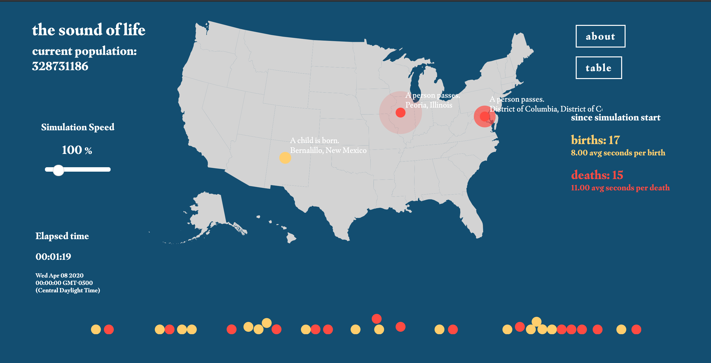
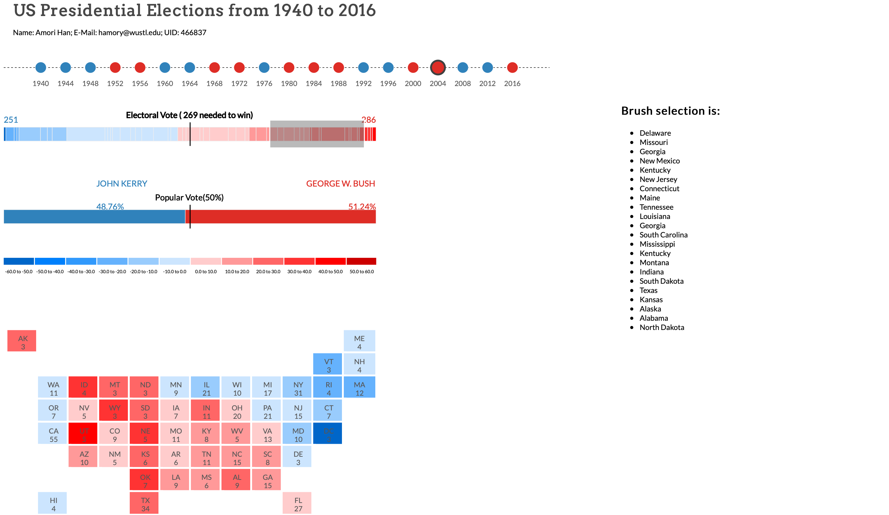
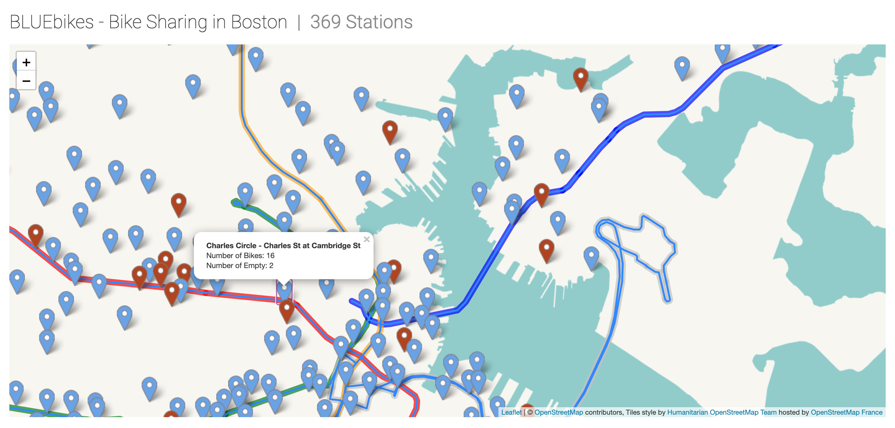

# My visualizations

All the interactive data visualization of mine.

### [Sound of Humanity](https://washuvis.github.io/soundofhumanity/draft-v4/index.html)

A simulation of the birth and death occurrence in the U.S. region with population data in 2019.

### [Electoral Map](datavis/Electoral)

Displayed the difference of support each party obtained from 1940-2016.

### [BLUEbikes Avaliability](datavis/BLUEbikes)

Stated the avliability of BLUEbikes within each station in the Boston region.

