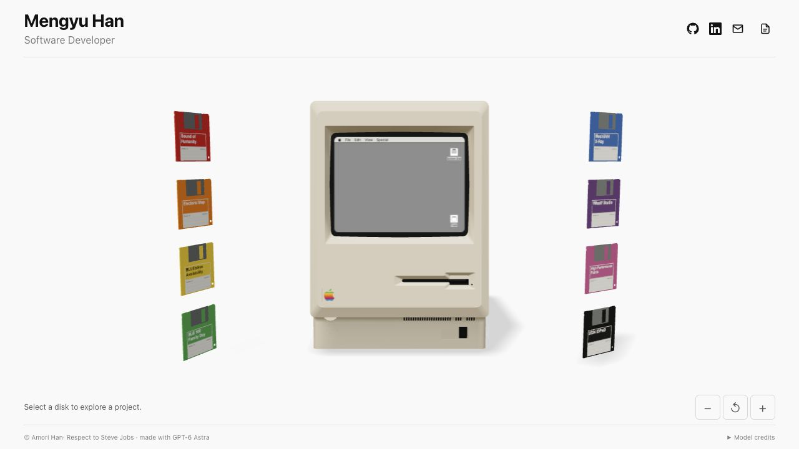

# Macintosh Portfolio

复古 Macintosh 风格的交互作品集。点击彩色软盘插入电脑，在 CRT 中查看作品介绍和真实项目网页。使用 HTML、ES modules、Three.js、html2canvas 和 PDF.js；无需框架、构建步骤或运行时 CDN。



## 快速开始

从本目录启动 HTTP 服务（需要 Python 3）：

```bash
python3 -m http.server 4173 --bind 127.0.0.1
```

打开 [http://localhost:4173/](http://localhost:4173/)。安装了 Node.js 的环境也可以使用 `npm run dev`，它调用同一个 Python 命令。不需要 `npm install`。

**不要直接打开 `file://.../index.html`。** 模型、ES modules、配置和 PDF 预览需要 HTTP(S)。浏览器需要支持 WebGL、ES modules、Web Workers 和原生 dialog；无法显示 3D 时请检查硬件加速。

## 一个配置文件完成个性化

编辑 [config.json](config.json)。[config.example.json](config.example.json) 提供通用姓名、邮箱和社交链接示例；若要使用它，请先备份自己的配置，再将其复制为 `config.json`。

配置加载时会进行校验，错误信息显示在页面底部操作区。JSON 必须使用双引号，不支持注释和尾随逗号。配置、PDF 和图片都是公开静态资源，**不要放入密码、API Key 或其他秘密**。

| 字段 | 作用 |
| --- | --- |
| `profile.name` / `profile.title` | 页头姓名和职业；默认浏览器标题也由此生成 |
| `profile.email` | 邮箱，不含 `mailto:`；其他链接可用 `$email` 引用 |
| `site.language` | HTML 文档语言，例如 `en`、`zh-CN`；不会自动翻译作品文案 |
| `site.pageTitle` / `site.description` | 浏览器标题和描述；留空时自动生成 |
| `socials` | 右上角链接，最多 5 个；支持 `github`、`linkedin`、`email` 图标 |
| `navigation` | 默认 `[]`；仅添加真实存在的页面，最多 6 项 |
| `footer.text` | 完整版权文案；非空时优先使用，不会随姓名自动变化 |
| `footer.note` | `footer.text` 为空时，追加到自动生成的版权文字后 |
| `projects` | 1-8 个作品，对应软盘数量与顺序 |
| `screen` | 全局项目介绍字号、按钮文字和默认配图 |
| `resume` | 简历图标、中英文 PDF、默认语言和下载名称 |

`profile.initials` 是兼容旧配置的保留字段，介绍页不再显示 AM / 姓名缩写。

### 基本资料与社交链接

以下是配置片段，替换对应字段即可：

```json
"profile": {
  "name": "Your Name",
  "title": "Designer & Developer",
  "email": "hello@example.com"
},
"socials": [
  { "label": "GitHub", "icon": "github", "href": "https://github.com/your-username" },
  { "label": "Email", "icon": "email", "href": "$email" }
],
"footer": { "text": "", "note": "Made with care" }
```

链接留空会隐藏。`navigation` 项可额外指定 `newTab`，以及 `screen: true`（最多 3 项）将真实导航同步到 CRT。默认不包含 About / Work 等不存在的页面。

## 作品、软盘颜色与图片

每个 `projects` 数组元素对应一张软盘。例如：

```json
{
  "title": "My Project",
  "desc": "A short introduction to my interactive project.",
  "color": "#507aba",
  "link": "https://example.com/project/",
  "screen": {
    "titleSize": 40,
    "descriptionSize": 17,
    "buttonSize": 18,
    "buttonText": "View project",
    "image": {
      "src": "./assets/projects/my-project.png",
      "alt": "A screenshot of my project",
      "fit": "cover"
    }
  },
  "embed": { "enabled": true, "width": 1300, "height": 980 }
}
```

- `color`：六位十六进制颜色，**同步软盘外壳和标签配色**。模型光照会影响屏幕上看到的颜色。
- `title`：同步软盘纸标签、介绍标题和项目选择器；纸标签自动换行。
- `desc`：介绍页正文。建议约 200 个英文字符以内，详细内容放在项目网页中。
- `link`：项目地址。留空或设为 `"#"`、且没有单独的嵌入地址时，仅展示介绍，不显示无效打开按钮。
- `screen.image.src`：实际图片文件路径。先添加文件，再修改配置；留空隐藏配图。
- 全屏背景介绍统一采用等比填满裁切，不会拉伸图片；旧配置里的 `fit` 仍可读取，但此布局始终使用 `cover`。
- PNG、JPG、WebP、SVG 可作为配图。推荐同站点资源；跨域图片需要允许 CORS，否则显示图片说明。

介绍采用全屏项目图片、浅色毛玻璃和最上层清晰文案三层布局，包含项目标题、介绍和 View project 按钮。模糊图层预先绘制到 canvas，因此在 3D CRT 纹理中同样生效，不依赖 html2canvas 不支持的 CSS backdrop-filter。没有配图时显示柔和底色。

逻辑画布为 640 × 480；默认标题 / 正文 / 按钮为 48 / 22 / 22 px。顶层 `screen` 定义全局默认值，单个项目的 `screen` 可覆盖。允许字号范围分别为 24-60、14-28、14-26；极长文案或最大字号可能超出固定大小的卡片。

示例截图位于 [assets/projects/](assets/projects/)，来源及第三方内容署名见 [素材说明](assets/projects/README.md)。替换这些图片和文案，使其准确反映自己的作品。

## 在 Mac 中打开项目

点击 CRT 内或屏幕下方的 **View project**，真实项目网页会在电脑屏幕内的 iframe 中打开，可操作其按钮、输入框和画布，而不只是显示截图。

- 默认使用项目 `link`；可通过 `embed.url` 提供独立的嵌入地址。
- `embed.width` / `embed.height` 是项目网页的虚拟视口，默认 1300 × 980。整个网页随 CRT 等比缩放，不分别拉伸横纵轴；不匹配的比例会留边。
- 宽度范围为 320-1920，高度为 240-1440。`embed.enabled: false` 改为独立打开。
- 项目介绍和交互网页共用机位；切换 **Intro** 不会重置手动缩放。
- 切换作品或退盘会移除旧 iframe，停止旧页面的运行和声音。
- 第三方站点可能用 CSP / X-Frame-Options 禁止嵌入。模板不能绕过该限制；使用外部打开按钮，或为自己的项目提供允许嵌入的地址。
- iframe 内部保留项目自身滚动与缩放；屏幕外的滚轮控制电脑机位。跨域 iframe 聚焦时，Esc 可能由项目自身处理，外部 Intro / Eject 按钮始终可用。

## 双语简历

点击右上角文件图标，或双击 Macintosh 桌面的 `Resume.pdf` 文件，打开同一个简历弹窗。桌面文件单击高亮选中，双击 / 手机双击或选中后按 Enter 打开；不复制简历数据。支持中文 / English 切换、逐页 PDF 预览、下载当前语言的原始 PDF、独立打开。

现已接入韩梦宇的正式中英文简历。更新时在 `assets/resume/` 放入带新版本标识的 PDF 并同步修改配置，避免沿用旧文件缓存。两种语言的预览和下载统一使用以下配置：

```json
"resume": {
  "enabled": true,
  "label": "简历 / CV",
  "defaultLanguage": "zh",
  "zh": { "src": "./assets/resume/Mengyu_Han_Resume_ZH-db3f78fdedb4.pdf", "filename": "Mengyu_Han_Resume_ZH.pdf" },
  "en": { "src": "./assets/resume/Mengyu_Han_Resume_EN-4b2df6000fb4.pdf", "filename": "Mengyu_Han_Resume_EN.pdf" }
}
```

- `label` 设置图标的悬停提示及无障碍名称。
- `defaultLanguage` 为 `zh` 或 `en`；切换文件不会自动翻译 PDF。
- `filename` 是下载名称，只填写以 `.pdf` 结尾的文件名，不包含目录。
- `src` 留空会显示该语言尚未提供；`enabled: false` 同时隐藏右上角入口和桌面简历文件。
- 单份文件不超过 20 MB。推荐同站点 PDF；外部文件需要允许 CORS，跨域失败时保留独立打开链接。
- 通过内置 PDF.js 渲染，不依赖浏览器 PDF 插件。阅读、滚动和关闭简历不会改变背后的场景或退盘。

## 操作与响应式布局

| 操作 | 结果 |
| --- | --- |
| 点击待选软盘 | 插入作品，随后相机移到放大的介绍位置 |
| 点击已插入软盘 / Eject / Esc | 退盘并返回初始最远位置 |
| 屏幕外鼠标滚轮 / − / + | 在有限范围内缩放电脑 |
| Reset | 有作品时回到插入机位；无作品时回到初始位置 |
| Previous / Next | 切换项目，放大后待选软盘出画时仍可使用 |
| 画布聚焦后左右方向键、Enter / Space | 选择并插入软盘 |

初始最远位置、插入后的放大位置和手动近端分别控制。插入后的取景优先保留 **CRT 和已插入软盘**；电脑外壳和待选软盘可离开画面。桌面根据宽高比排列软盘；手机保留桌面单排场景及相机路径，横向滑动仅移动待选软盘，电脑始终居中。

手机端电脑与软盘始终位于同一个 3D 场景，保留真实模型的倾斜角度、光照、标签和插入动画，不生成独立缩略图栏。仅软盘区域响应左右滑动，电脑和相机不随滑动改变；点击后从软盘当前位置插入电脑。介绍 / 交互机位保持一致，并按可见手机宽度限制自动放大。

页面使用固定动态视口，不产生整页滚动条；手机软盘行、PDF、项目 iframe、署名弹层等内部内容保留独立滚动。支持 `prefers-reduced-motion`。

模型加载时显示本地内联的虚线 Happy Macintosh：轻轻浮动、眨眼与跳动的加载点。真实模型和首张 CRT 纹理完成渲染后才淡出，不显示虚假进度。加载失败时停止动画并提示重新加载；减少动态效果偏好下使用静态图标。

## 测试与目录

测试需要 Node.js 22 或更新版本，无需安装 npm 依赖：

```bash
npm test
```

测试涵盖配置校验、软盘真实模型与标签、插入尺寸及动画、相机边界、介绍 / 交互机位一致性、iframe 投影、PDF 校验与语言切换。发布前验证了 66 项测试。

可选的 [Demo 录制工具](demo/README.md) 使用 `?demo=record` 开启，直接下载 WebM，无需上传接口或独立后端。它只记录本页面的画布和 DOM，不包含跨域项目 iframe 的内容。

```text
macintosh-portfolio/
├── index.html                 # 页面结构与样式
├── config.json                # 当前作品集配置
├── config.example.json        # 通用配置起点
├── app.mjs / configuration.mjs
├── hero.mjs / scene-*.mjs      # 3D 场景与动画
├── project-*.mjs               # 介绍、纸标签
├── screen-portal.mjs           # CRT 内交互网页
├── resume*.mjs / resume-preview.html
├── assets/                    # 模型、截图、双语 PDF
├── vendor/                    # Three.js、html2canvas、PDF.js 与许可证
├── tests/                     # Node 内置测试
└── tools/                     # 仓库原有模型编辑工具
```

原有 `CONCEPT.md`、`WORKLOG.md`、`models/` 和 `tools/` 作为设计 / 工具资料保留，不是当前运行时的配置入口。

## 静态部署

将本目录的运行文件与 `assets/`、`vendor/` 保持相对路径上传到静态站点即可；没有构建产物。可放在站点根目录，也可放在 `/macintosh-portfolio/` 等子目录。部署服务需正确提供 `.mjs` JavaScript、`.wasm` WebAssembly 和 PDF 文件。

本仓库是个人主页部署版本。根目录 `index.html` 使用 `<base href="/macintosh-portfolio/">` 共享本目录资源和配置，GitHub Pages 工作流发布整个仓库。更新页面结构时请同步根目录入口并保留该 base 标签；日常修改资料、作品、图片和简历只需更新本目录配置与资源。通用模板见 [MyPortfolioTemplates](https://github.com/Amory0709/MyPortfolioTemplates)。

只上传需要公开的资源。`tests/`、`docs/` 和旧设计工具不影响模板运行，部署时可省略；不要遗漏简历的 `resume-preview.html`、`resume-preview.mjs` 或 `vendor/pdfjs/`。

## 许可与署名

- 本仓库代码：[MIT](../LICENSE)。
- Macintosh 模型：Daz，[Macintosh 128K Computer (1984)](https://skfb.ly/6SLnE)，[CC BY-NC 4.0](https://creativecommons.org/licenses/by-nc/4.0/)。**该模型带有非商业限制**，不应把仓库代码的 MIT 许可当作模型的商用授权。
- 软盘模型：Kyan0s，[Floppy Disk 3.5](https://skfb.ly/Jnrs)，[CC BY 4.0](https://creativecommons.org/licenses/by/4.0/)。
- Three.js r160：[MIT](vendor/three/LICENSE)。
- html2canvas：[MIT](vendor/html2canvas.LICENSE)。
- PDF.js 5.6.205：[Apache-2.0](vendor/pdfjs/LICENSE)，运行所需字体等文件随包保留其许可证。
- 示例项目截图以及截图内的地图、模型和页面内容仍归各自来源，见 [预览来源](assets/projects/README.md)。

请保留必要署名；原页面的 Model credits 入口仍可查看模型来源。
